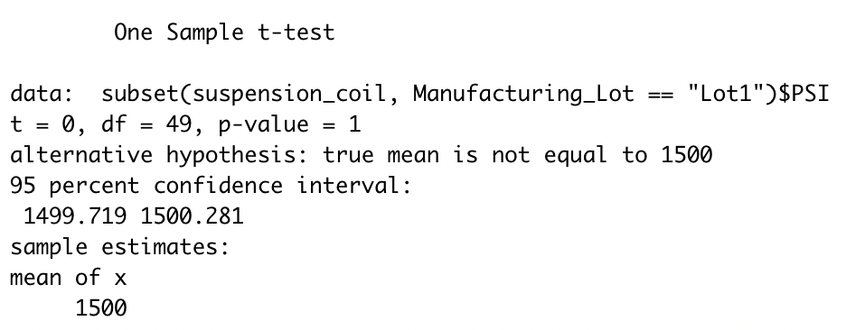

# MechaCar_Statistical_Analysis

## Overview
This analysis looks at production data for an auto company. The findings below provide insight into the manufacturing issues the team is experiencing and clarifies how they can be resolved.

## Linear Regression to Predict MPG
- The vehicle_length and ground_clearance data provided a non-random amount of variance to the mpg values in the dataset. As seen in the below image, the p-values of 2.6x10-12 and 5.21x10-8 are not significant.

- The slope is not considered to be zero as the p-value is 5.35x10-11. Because of this, there is sufficient evidence to reject the null hypothesis.

- With the r-squared value at 0.7149 or 71.5%, the accuracy of the linear model's predicttion of mpg for MechaCar prototypes is fair, but should be improved.

## Summary Statistics on Suspension Coils
The design specifications for the MechaCar suspension coils dictate that the variance of the suspension coils must not exceed 100 pounds per square inch. Does the current manufacturing data meet this design specification for all manufacturing lots in total and each lot individually? Why or why not?

## T-Tests on Suspension Coils
Briefly summarize your interpretation and findings for the t-test results. Include screenshots of the t-test to support your summary.

## Study Design: MechaCar vs Competition
Write a short description of a statistical study that can quantify how the MechaCar performs against the competition. In your study design, think critically about what metrics would be of interest to a consumer: for a few examples, cost, city or highway fuel efficiency, horse power, maintenance cost, or safety rating.

In your description, address the following questions:
What metric or metrics are you going to test?
What is the null hypothesis or alternative hypothesis?
What statistical test would you use to test the hypothesis? And why?
What data is needed to run the statistical test?
